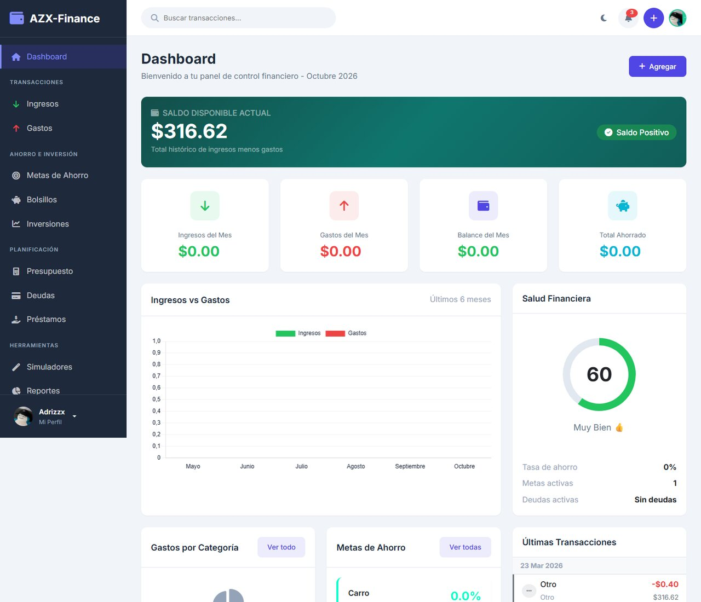
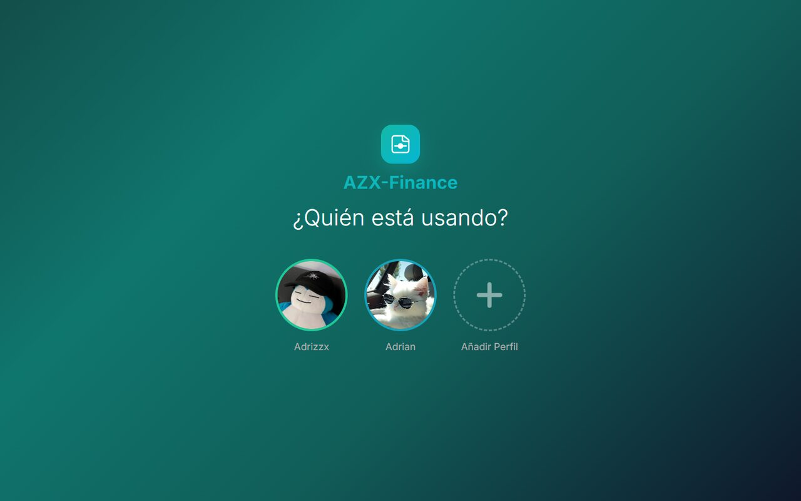
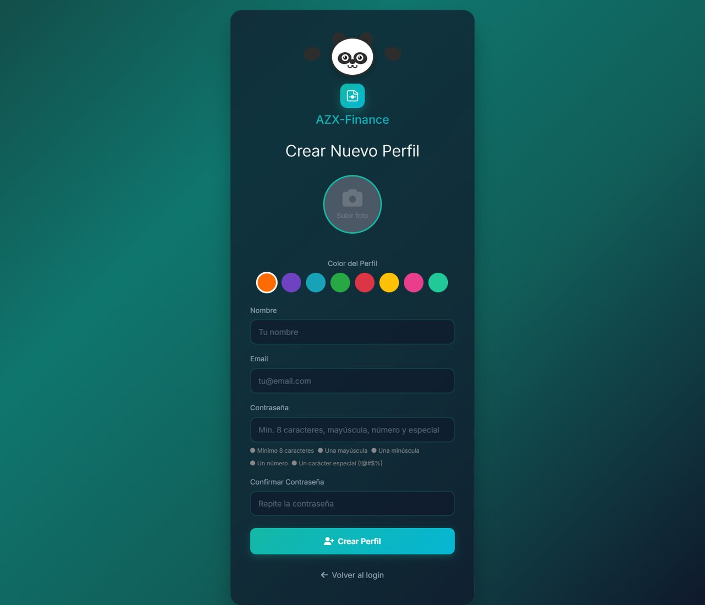
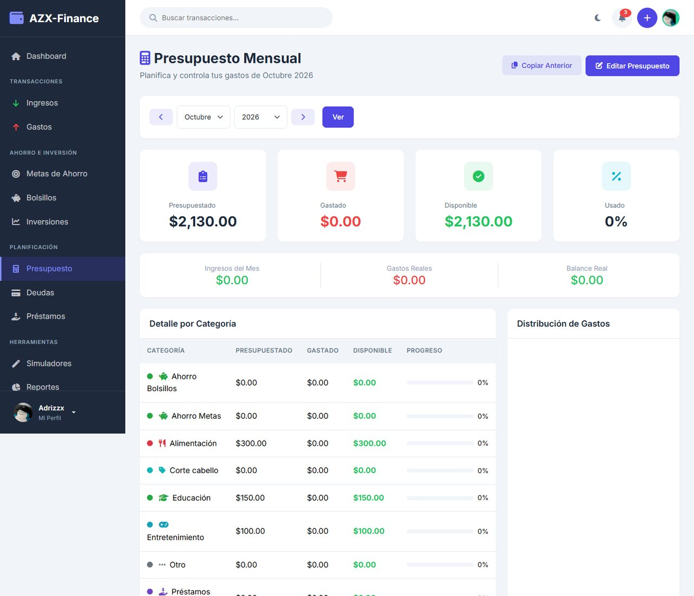
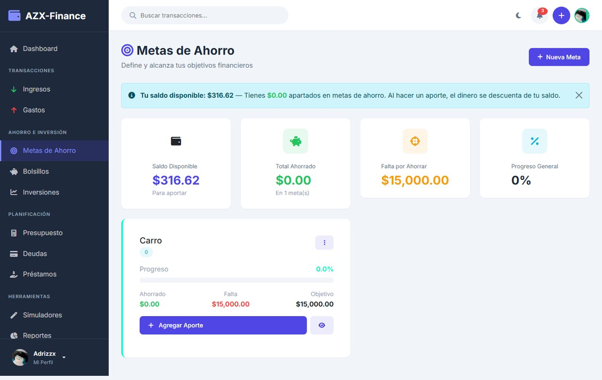
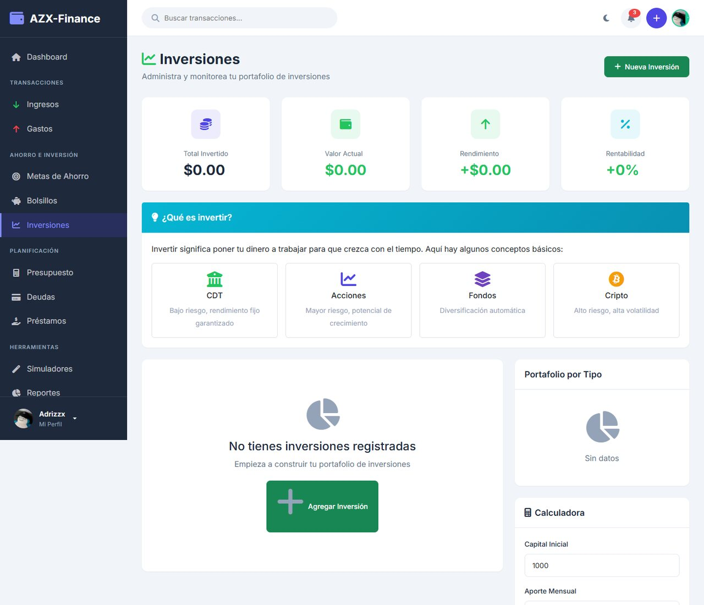
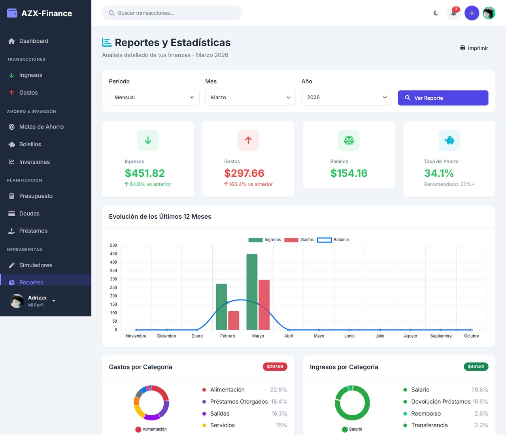
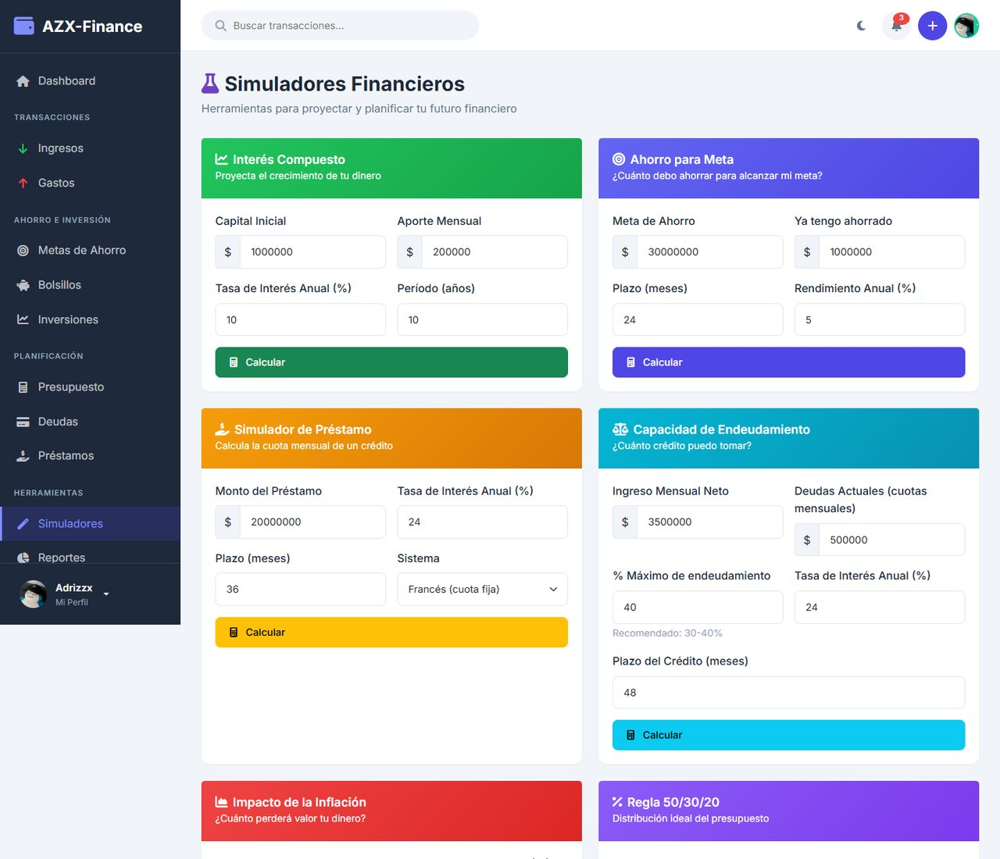
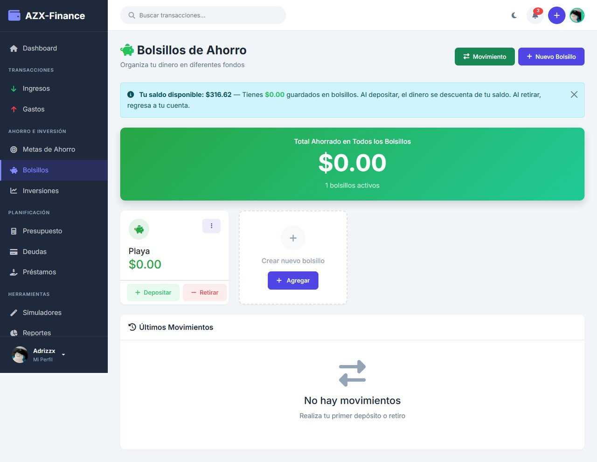

<div align="center">

# AZX-Finance

### Plataforma web de finanzas personales con perfiles múltiples, metas, inversiones y reportes

[](https://www.php.net/)
[](https://www.mysql.com/)
[](https://getbootstrap.com/)
[](https://www.chartjs.org/)
[](https://developer.mozilla.org/docs/Web/JavaScript)




</div>

---

## Descripción

**AZX-Finance** es una aplicación web para administrar las finanzas personales de punta a punta: ingresos, gastos, presupuestos, ahorros, deudas, préstamos e inversiones, con un **dashboard visual** y **simuladores financieros**. Varias personas pueden compartir la misma instalación gracias a un sistema de **perfiles estilo Netflix**, cada uno protegido con su propia contraseña.

El proyecto estuvo desplegado en un hosting público y fue construido con PHP nativo bajo una estructura modular, sin frameworks, priorizando la seguridad en el acceso a datos.

## Capturas

<table>
  <tr>
    <td width="50%"></td>
    <td width="50%"></td>
  </tr>
  <tr>
    <td align="center"><sub>Selección de perfil estilo Netflix</sub></td>
    <td align="center"><sub>Registro de perfil con avatar y color</sub></td>
  </tr>
  <tr>
    <td width="50%"></td>
    <td width="50%"></td>
  </tr>
  <tr>
    <td align="center"><sub>Presupuesto mensual por categoría</sub></td>
    <td align="center"><sub>Metas de ahorro con progreso</sub></td>
  </tr>
  <tr>
    <td width="50%"></td>
    <td width="50%"></td>
  </tr>
  <tr>
    <td align="center"><sub>Portafolio de inversiones</sub></td>
    <td align="center"><sub>Reportes y gráficos</sub></td>
  </tr>
  <tr>
    <td width="50%"></td>
    <td width="50%"></td>
  </tr>
  <tr>
    <td align="center"><sub>Simuladores financieros</sub></td>
    <td align="center"><sub>Bolsillos de ahorro</sub></td>
  </tr>
</table>

## Funcionalidades

| Módulo | Descripción |
|---|---|
| **Perfiles** | Selección de perfil con avatar y color, acceso por contraseña, perfiles ordenados por último uso |
| **Dashboard** | Ingresos y gastos del mes, balance, total ahorrado, deudas activas, gráfico de gastos por categoría y progreso de metas |
| **Ingresos y gastos** | Registro por categorías personalizables, filtros por fecha y montos |
| **Presupuesto mensual** | Límite por categoría con seguimiento del consumo real |
| **Metas de ahorro** | Objetivos con prioridad, aportes parciales y porcentaje de avance |
| **Bolsillos** | Separación del ahorro en bolsillos y transferencias entre ellos |
| **Deudas y préstamos** | Saldo pendiente, historial de pagos y préstamos otorgados a terceros |
| **Inversiones** | Portafolio por tipo de inversión con rendimiento |
| **Simuladores** | Interés compuesto, regla 50/30/20, inflación, capacidad de endeudamiento y meta de ahorro |
| **Conversor de monedas** | Conversión entre divisas |
| **Reportes** | Gráficos y resúmenes por período |
| **Tema claro / oscuro** | Preferencia guardada por usuario |

## Tecnologías

- **Backend:** PHP 8 (nativo), PDO con consultas preparadas
- **Base de datos:** MySQL / MariaDB (20 tablas relacionadas)
- **Frontend:** HTML5, CSS3, JavaScript ES6, Bootstrap 5.3, Chart.js, SweetAlert2, Font Awesome
- **Despliegue:** hosting Apache + MySQL (InfinityFree)

## Seguridad

- Contraseñas almacenadas con `password_hash()` y verificadas con `password_verify()`.
- **Más de 170 consultas preparadas** con PDO: sin concatenación de SQL, protegido contra inyección.
- Salida escapada con `htmlspecialchars()` para prevenir XSS.
- Control de sesión en cada página y credenciales de la base de datos fuera del repositorio.

## Estructura del proyecto

```
AZX-Finance/
├── index.php              # Dashboard
├── login.php              # Selección de perfil e inicio de sesión
├── registro.php           # Creación de perfil (avatar, color, contraseña)
├── todos-perfiles.php
├── api/                   # Endpoints AJAX (categorías, validación de email)
├── pages/                 # Módulos: ingresos, gastos, metas, ahorros, deudas,
│                          # préstamos, presupuesto, inversiones, simuladores,
│                          # conversor, reportes, perfil
├── includes/              # Header y footer compartidos
├── config/
│   ├── config.php         # Constantes de la aplicación y sesión
│   └── database.example.php
├── assets/                # CSS y JavaScript
├── database/
│   └── azx_finance.sql    # Esquema y datos de ejemplo
└── docs/
    └── GUIA_PRUEBAS.md    # Casos de prueba por módulo
```

## Modelo de datos

```mermaid
erDiagram
    usuarios ||--o{ categorias_ingresos : "usuario_id"
    usuarios ||--o{ categorias_gastos : "usuario_id"
    usuarios ||--o{ ingresos : "usuario_id"
    categorias_ingresos ||--o{ ingresos : "categoria_id"
    usuarios ||--o{ gastos : "usuario_id"
    categorias_gastos ||--o{ gastos : "categoria_id"
    usuarios ||--o{ metas_ahorro : "usuario_id"
    metas_ahorro ||--o{ aportes_metas : "meta_id"
    usuarios ||--o{ bolsillos_ahorro : "usuario_id"
    bolsillos_ahorro ||--o{ movimientos_bolsillos : "bolsillo_id"
    bolsillos_ahorro ||--o{ movimientos_bolsillos : "bolsillo_destino_id"
    usuarios ||--o{ presupuestos_mensuales : "usuario_id"
    categorias_gastos ||--o{ presupuestos_mensuales : "categoria_gasto_id"
    usuarios ||--o{ inversiones : "usuario_id"
    tipos_inversion ||--o{ inversiones : "tipo_id"
    usuarios ||--o{ deudas : "usuario_id"
    deudas ||--o{ pagos_deudas : "deuda_id"
    usuarios ||--o{ recordatorios : "usuario_id"
    usuarios ||--o{ configuracion_usuario : "usuario_id"
    usuarios ||--o{ historial_saldo : "usuario_id"
    usuarios ||--o{ prestamos : "usuario_id"
    prestamos ||--o{ pagos_prestamos : "prestamo_id"
    usuarios {
        int id PK
        varchar nombre
        varchar email
    }
    categorias_ingresos {
        int id PK
        int usuario_id FK
        varchar nombre
    }
    categorias_gastos {
        int id PK
        int usuario_id FK
        varchar nombre
    }
    ingresos {
        int id PK
        int usuario_id FK
        int categoria_id FK
    }
    gastos {
        int id PK
        int usuario_id FK
        int categoria_id FK
    }
    metas_ahorro {
        int id PK
        int usuario_id FK
        varchar nombre
    }
    aportes_metas {
        int id PK
        int meta_id FK
        decimal monto
    }
    bolsillos_ahorro {
        int id PK
        int usuario_id FK
        varchar nombre
    }
    movimientos_bolsillos {
        int id PK
        int bolsillo_id FK
        int bolsillo_destino_id FK
    }
    presupuestos_mensuales {
        int id PK
        int usuario_id FK
        int categoria_gasto_id FK
    }
    tipos_inversion {
        int id PK
        varchar nombre
        varchar icono
    }
    inversiones {
        int id PK
        int usuario_id FK
        int tipo_id FK
    }
    deudas {
        int id PK
        int usuario_id FK
        varchar nombre
    }
    pagos_deudas {
        int id PK
        int deuda_id FK
        decimal monto
    }
    recordatorios {
        int id PK
        int usuario_id FK
        varchar titulo
    }
    configuracion_usuario {
        int id PK
        int usuario_id FK
        enum tema
    }
    historial_saldo {
        int id PK
        int usuario_id FK
        date fecha
    }
    monedas {
        int id PK
        varchar codigo
        varchar nombre
    }
    prestamos {
        int id PK
        int usuario_id FK
        varchar deudor_nombre
    }
    pagos_prestamos {
        int id PK
        int prestamo_id FK
        decimal monto
    }
```



## Instalación local

**Requisitos:** PHP 8+, MySQL 8 o MariaDB, Apache (XAMPP, Laragon o similar).

```bash
# 1. Clonar el repositorio dentro de htdocs / www
git clone https://github.com/Adrizzx/AZX-Finance.git

# 2. Crear la base de datos con el script incluido
mysql -u root -p < AZX-Finance/database/azx_finance.sql

# 3. Configurar la conexión
cp AZX-Finance/config/database.example.php AZX-Finance/config/database.php
# y editar DB_HOST, DB_NAME, DB_USER y DB_PASS

# 4. Ajustar BASE_URL en config/config.php y abrir en el navegador
```

Los usuarios de prueba y los casos de verificación por módulo están en [`docs/GUIA_PRUEBAS.md`](docs/GUIA_PRUEBAS.md).

## Autor

**Marco Adrián Padilla Triviño** · Estudiante de Ingeniería de Software, Universidad de las Fuerzas Armadas ESPE

[](https://github.com/Adrizzx)
